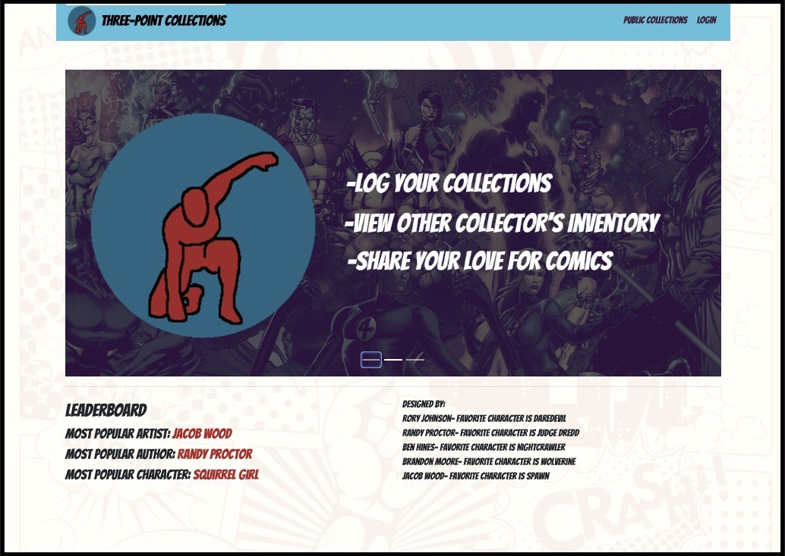

# ThreePointComicCollection
A Dynamic Comic Book Collection Website created as a capstone project at Tech Elevator Cincinnati in 2020.

 

### Stack and Various Tech

- ***ES6 Javascript*** for front-end
- ***Vue.js*** framework for model-view-viewmodel architecture
- ***VueX*** for global, flux-like state-management
- ***Bootstrap*** paired with ***CSS3*** Flex for UI
- ***Java*** for back-end
- ***Apache Tomcat*** as HTTP web server
- ***PostgreSQL*** for RDBMS

 

### Demo

Please follow this YouTube link to see an abridged video of the capstone presentation: https://www.youtube.com/watch?v=3SvAkgXw7RQ

 